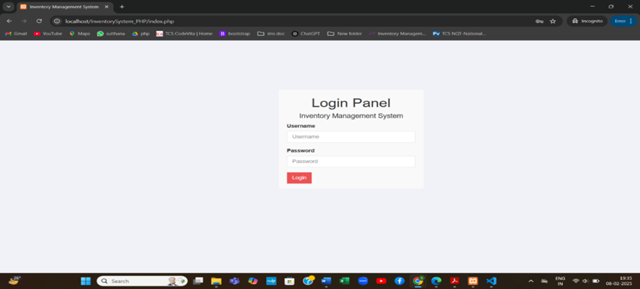
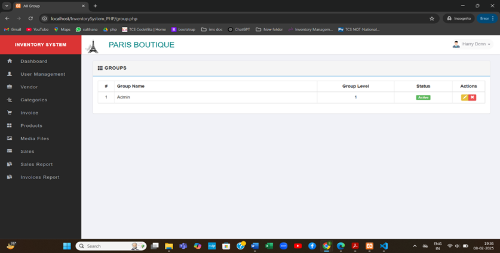
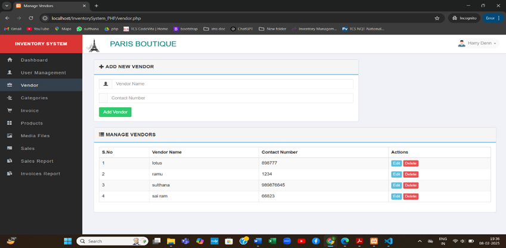
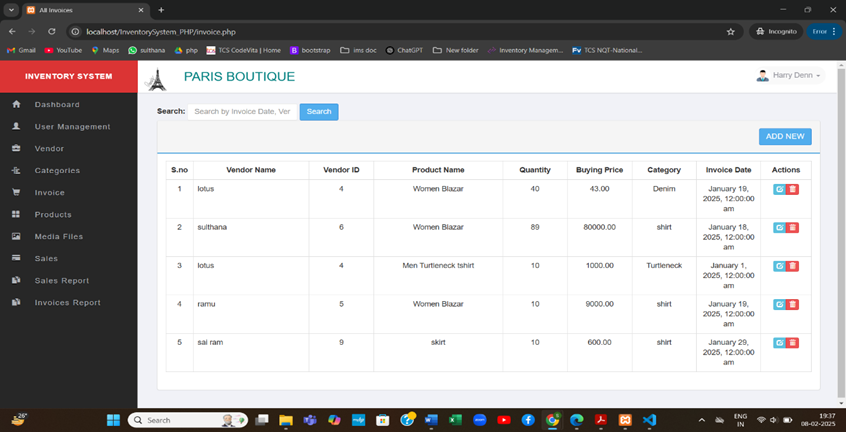
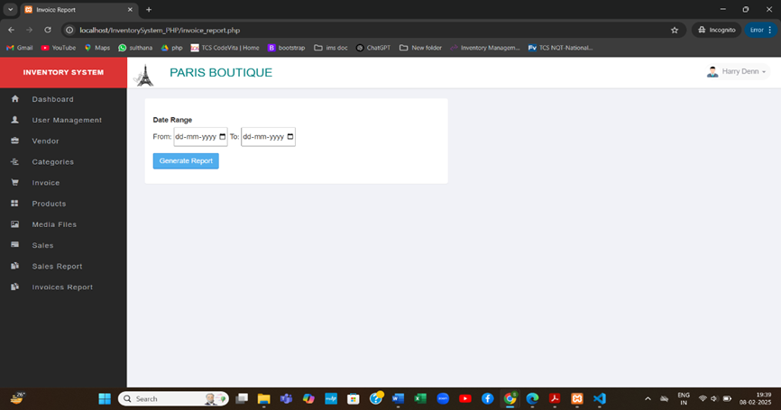

### PROJECT DETAILS
### MODULES
In this Inventory Management System project, we use PHP and MySQL Database. This project has Admin module which has many submodules.
### ADMIN
       1. LOGIN PANEL: Admin can login with the registered username and password.
       2. PROFILE: Admin can edit their profile details.
       3. DASHBOARD: can view total no of users, categories, products, sales.
       4. USER MANAGEMENT: In manage categories, admin can edit their active status and in mange user, admin can add new user and edit user.
       5. VENDOR: Admin can add vendor details and manage vendors.
       6. CATEGORIES: Admin can add product categories and manage the categories.
       7. INVOICE: Admin can add invoice details and manage the invoices by using the details.
       8. PRODUCT: Admin can add product and product details and manage products.
       9. MEDIA FILES: Admin can upload media files for the products.
      10. SALES: Admin can add sales details and manage sales.
      11. SALES REPORT: Admin can generate sales report and profit details in particular dates.
      12. INVOICE REPORT: Admin can generate invoice report and profit details in particular dates. 
 
### SCREENSHOTS

### Admin login

### Dashboard

### User management

### Vendor management

### Invoice management

### Product management

### Sales management

### Invoice report

